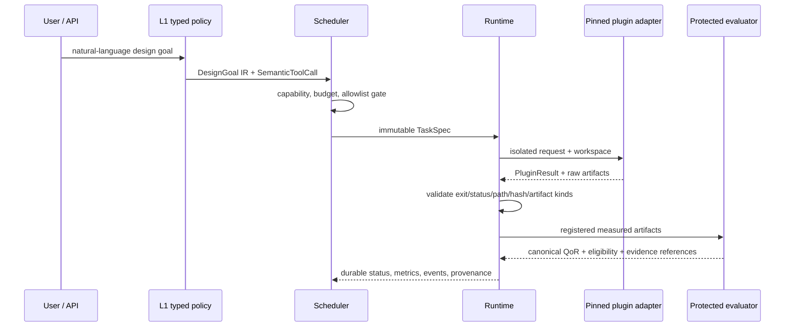

# OpenROAD Platform Architecture

## Purpose

OpenROAD Platform is a control plane for reproducible, agent-assisted chip
design experiments.  It turns a validated design goal into typed requests to
reviewed capabilities, supervises their execution, and records comparable
QoR evidence.  It does **not** claim ownership of every underlying research
algorithm.

The enduring model is:

```text
Natural-language request
        |
        v
L1 goal compiler -> DesignGoal IR -> typed semantic tool calls
        |
        v
Thin platform scheduler / policy gate
        |
        +-- RTL generation/evolution plugin
        +-- DSE plugin (for example, an admitted upstream ORFS-Agent)
        +-- EDAIR data-interface plugin
        +-- repair/diagnosis plugin
        +-- bounded ECO plugin
        +-- source-optimization plugin
        +-- evidence-gated memory plugin
        |
        v
Unified Runtime -> attempt workspaces -> artifacts -> protected evaluator
        |                                                  |
        +--------------- durable events and provenance ----+
```

## Responsibilities and boundaries

| Layer | Owns | Must not own |
| --- | --- | --- |
| Contracts | versioned data types, capability/manifest schema, typed semantic calls | policy algorithms, process launch, web state |
| Application/API | authentication, request validation, composition, read models | EDA subprocesses, QoR truth, optimizer implementation |
| Scheduler/policy | approved task ordering, budgets, capability selection, checkpoints | concrete ORFS/RTL/optimizer internals |
| Runtime | attempts, leases, workspaces, resources, timeout/cancel/recovery, artifact registration | an upstream algorithm's choice of candidate |
| Evaluator | deterministic artifact-backed QoR, eligibility, protocol/statistics | trial scheduling, LLM judgement, benchmark mutation |
| Plugin adapter | schema/lifecycle/config/artifact/error translation | a replacement upstream algorithm or Runtime state authority |
| External project | its native algorithm and native evidence | platform-wide state, credentials, or protected protocol |

The admissible capability domains are workflow orchestration, RTL
generation/evolution, design-space exploration, bounded ECO, source-level
optimization, repair/diagnosis, natural-language-to-EDA interaction, and the
EDA-to-AI structured data interface.  Every domain crosses layers through the
same plugin contract; domains may not import each other's private code.

## Core contracts and plugin lifecycle

`PluginManifest` advertises an immutable identity, version, capability,
architecture, input/output schema, tool requirements, timeout, constrained
environment, and permitted artifact kinds.  `TaskSpec` is the reviewed,
bounded request.  Runtime invokes the adapter in an isolated attempt workspace.
`PluginResult` is checked against the exit code, schema, paths, artifact rules,
and hashes before it can affect durable state.



An adapter may map schema, configuration, lifecycle, artifacts, and structured
errors.  It may not silently fall back to a local algorithm, edit a benchmark,
or promote an unverified result.

## Evidence and evaluation

The protected evaluation boundary freezes benchmark RTL, PDK, constraint file,
toolchain snapshot, seeds, objective/constraint definitions, parameter search
space, budget, evaluator version, and statistics definition.  Raw outputs are
the source of truth.  EDAIR/AI-facing summaries are loss-accounted index
objects: they retain artifact/run references, hashes, parser versions, and a
statement of what was not represented.

QoR claims are made only from repeated, artifact-backed measurements under the
same protocol.  Predictions, model explanations, dashboards, and LLM text are
not canonical metrics.

## Dependency direction

The intended dependency direction is inward and acyclic:

```text
apps (transport/composition)
        -> scheduler/policy -> runtime/execution -> evaluator/data views
                                             \-> contracts
plugins/adapters -----------------------------> contracts
evaluator/data views --------------------------> contracts
visualization ---------------------------------> contracts
```

`contracts` is dependency-free.  The evaluator is deterministic platform
infrastructure, not an optimizer.  A scheduler interacts with a concrete
capability through a factory/registry contract, not through imports such as
`build_orfs_task`.  Runtime sees a manifest and a task, not an optimizer's
private state.

## Target repository shape

This is a target ownership map, not an instruction to move files wholesale:

```text
apps/
  api/                 transport and application composition only
  web/                 presentation only
packages/
  contracts/           stable public types and schemas
  runtime/             attempts, resources, adapters, registry, artifacts
  scheduler/           campaigns and typed policy gates
  evaluator/           deterministic QoR, EDAIR, protocol, statistics
  visualization/       non-authoritative views
integrations/
  <plugin>/            manifest, source/environment lock, license audit, adapter
research/
  archive/             historical plans, reports, and non-production studies
```

The current package names can evolve one small migration slice at a time.  The
ownership boundary is more important than directory renaming.

## External source admission

An external source must be pinned, license-audited, environment-isolated, and
smoke-tested natively and through Runtime.  A project with missing license
evidence remains source-audit-only.  A plugin's native executable is never a
second scheduler: the platform remains responsible for resources, lifecycle,
canonical QoR, and provenance.

