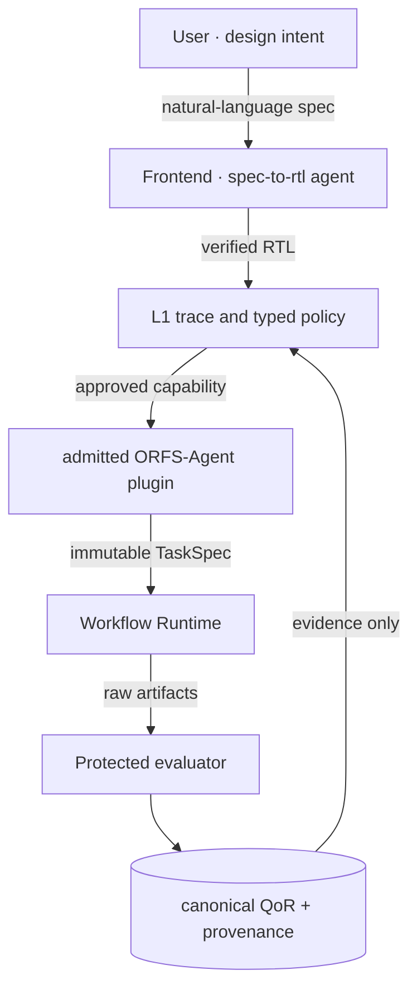
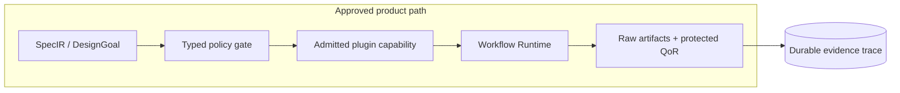

# OpenROAD Self-Evolving EDA Platform

> **English** · [中文](README.zh-CN.md)

An evidence-first, plugin-based control plane for reproducible chip-design experiments.

---

## What is this

Turning chip design from a manual flow into an **automated + self-learning** open platform:

- **Typed interaction**: natural language becomes a reviewed SpecIR/DesignGoal and typed tool calls, never arbitrary shell text.
- **Product path**: platform-managed RTLScout produces independently verified RTL; the admitted ORFS-Agent plugin is the sole 2D design-space-exploration product path.
- **Open extension**: plugins execute through bounded adapters, Runtime and protected evaluation; 3D and specialty tools remain independent capabilities.

**In one sentence: approved intent enters, independently verified evidence returns, and the platform never substitutes itself for an upstream research algorithm.**

---

## Architecture


*Overall: typed interaction → approved capability → durable Runtime → raw artifacts → protected QoR and provenance.*


*Natural-language SpecIR → platform-managed RTLScout → independent verification → verified RTL → DesignGoal/typed policy → admitted ORFS-Agent → immutable TaskSpec → Runtime → raw artifacts → protected QoR.  TaiWei 3D is a separate plugin workflow; research comparators are not product modes.*

### Product architecture



### Product execution boundary



---

## Feature Status

| Feature | Status | Notes |
| --- | --- | --- |
| 2D physical design (ORFS 6-stage) | ✅ Working | Nangate45 RTL→GDS verified end-to-end |
| 3D physical design (TaiWei) | Independent plugin | Separately admitted capability; not part of the 2D product state machine |
| Web workspace | Legacy UI | Frozen from product growth; it remains a transitional historical/developer surface pending P3 isolation |
| Natural-language RTL generation | ✅ Available | Server Codex parses SpecIR; a separate verification agent freezes a testbench/oracle before RTLScout candidate search |
| Frontend LLM entry | ✅ Available | Three entry buttons (upload / LLM spec / examples), agent run trace dashboard |
| Product control plane | ✅ Working | SpecIR/RTL evidence, Runtime attempt control, artifact provenance and protected evaluation; L1 durable trace is planned |
| L2 design-space exploration | Admitted plugin | ORFS-Agent is the sole product optimizer; local BO/GP remains research-only |
| Agent trace dashboard | Planned L1 | Durable Goal → ToolCall → Runtime → Evidence trace workspace |
| Plugin ecosystem | Governed admission | Every plugin requires a pinned source, license conclusion and bounded smoke |
| No-auth internal mode | ✅ Available | `OPENROAD_PLATFORM_NO_AUTH=1` skips registration |
| Platform model | ✅ Server managed | Fixed internal Codex model; browser accepts no Provider or API key |

> Full capability map: Overview page + [Tutorial 01](docs/tutorials/01_openroad_platform_overview.md).

---

## Repository Layout

```text
openroad-platform/
├── apps/
│   ├── api/                 # Backend: HTTP API, design/task/learning services
│   └── web/                 # Frontend web workspace (bilingual)
├── packages/
│   ├── contracts/           # Data contracts: TaskSpec / PluginManifest / artifact rules
│   ├── scheduler/           # Scheduling: SQLite queue, Runtime, worker; research campaigns stay outside the product API
│   ├── execution/           # Execution: plugin registry, 2D/3D adapters, process isolation
│   ├── analysis/            # Analysis + learning: metrics, knowledge, GP/BO, suggestions
│   └── visualization/       # Visualization: Graphviz, KLayout, 3D views
├── integrations/            # Plugin manifests and pinned source audits
├── workflows/               # Standard flow guides (spec-to-gds / three_d / ...)
├── scripts/                 # Launch, worker, acceptance, toolchain build
├── tests/                   # Automated tests (pytest)
├── docs/                    # Docs: architecture, HTML tutorials, operations, plugins
├── knowledge/               # Public knowledge corpus
├── project_kb/              # Technical decisions and lessons
├── var/                     # Runtime evidence (git-ignored, do not delete)
└── .tools/  .external-src/  # Local toolchains / pinned third-party sources (ignored)
```

---

## Development Model

- **Plugin development**: each plugin is an independently reviewed manifest,
  source/environment lock and bounded adapter.  Admission occurs through the
  Plugin Registry and capability contract; adding a plugin must not require an
  API route branch, an `execution/__init__.py` export, or a change to the
  protected evaluator.  Developers of different plugins do not share private
  dependencies.
- **Branch flow**: feature branch → commit → full test suite → merge to main.
- **Testing**: `python3 -m pytest -q` (currently 233 passed).

> Plugin guide: [docs/PLUGINS.md](docs/PLUGINS.md) · [CONTRIBUTING.md](CONTRIBUTING.md)

---

## API & Plugins

REST API (every web feature is callable via API):

| Endpoint | Purpose |
| --- | --- |
| `/api/auth/*` | Login / register (skippable in no-auth mode) |
| `/api/spec/sessions` → `/api/rtl/specs/<id>/run-to-baseline` | Sole natural-language SpecIR → independently verified RTLScout path |
| `/api/designs/*` | Registered design evidence; direct RTL intake remains a reachable legacy route that can still bypass verified-RTL provenance into L2 pending P2 isolation, and is not a supported product path |
| `/api/runtime/runs/*` | Internal child-run progress, cancel, evidence, and artifacts |
| `/api/v2/external-optimizer-loops` | The only 2D product start endpoint: repeated baseline → pinned ORFS-Agent GP/EI → repeated QoR evaluation |
| `/api/v2/external-optimizer-loops/<id>/advance` | Records a safe controller transition; the worker, never the browser, executes tools |
| `/api/agent/traces` | Agent run traces (every LLM/agent operation, auditable) |
| `/api/extensions/taiwei/run` | Independent 3D plugin task submit |
| `/api/extensions/edacraft/*` | Specialist tools (TCAD / SPICE / ...) |
| `/api/platform/results` | Projects and results |
| `/api/learning/observations` | Read-only evidence learned automatically by the closed loop |

**Plugin three pieces**: ① `plugin.json` (identity: capabilities/tools/artifact rules)
② `xxx_plugin.py` (TaskSpec builder) ③ `xxx_adapter.py` (runs the tool, collects outputs).
See [docs/PLUGINS.md](docs/PLUGINS.md).

---

## Quick Start

### Same server (no clone needed)

The repo lives at `/share/home/yuanwenjie/openroad-platform` on this cluster (`~` expands to each user's own home directory, so the exact path differs per user — run `echo $HOME` to find yours):

```bash
cd /share/home/yuanwenjie/openroad-platform
HOST=127.0.0.1 PORT=8000 ./scripts/run_demo.sh
# optional internal no-auth mode: export OPENROAD_PLATFORM_NO_AUTH=1 before starting
```

Open `http://127.0.0.1:8000` (remote machine: use SSH tunnel):

```bash
ssh -N -L 8000:127.0.0.1:8000 <user>@<server>
```

### Fresh machine (clone)

```bash
git clone https://github.com/CODA-Team/ChipEvolve.git
cd ChipEvolve
python3 -m pip install -e '.[test,visualization,optimization,distributed]'
./scripts/run_demo.sh
```

### Run worker and web separately (recommended)

```bash
export PLATFORM_STATE=/tmp/openroad-platform-$UID
mkdir -p "$PLATFORM_STATE"

# Terminal 1: generic plugin worker (non-DSE jobs)
python3 scripts/run_runtime_worker.py \
  --db var/platform.db --orfs-root ../OpenROAD-flow-scripts \
  --runtime-db "$PLATFORM_STATE/runtime.db"

# Terminal 2: durable DSE controller (owns v2 quick/full Runtime jobs)
python3 scripts/run_dse_controller_worker.py \
  --db var/platform.db --orfs-root ../OpenROAD-flow-scripts \
  --runtime-db "$PLATFORM_STATE/runtime.db"

# Terminal 3: web
python3 apps/api/app.py --host 127.0.0.1 --port 8000 \
  --db var/platform.db --orfs-root ../OpenROAD-flow-scripts \
  --runtime-db "$PLATFORM_STATE/runtime.db"
```

### Transitional development note

The existing Web workspace is legacy presentation, not the product workflow
guide.  Until P3 and the new L1 trace workspace are complete, use the approved
API path: create a natural-language SpecIR session, complete independent
verification and RTLScout, then start the admitted ORFS-Agent L2 loop from the
verified RTL evidence.  TaiWei 3D and specialist extensions are independent
plugin workflows.  Direct RTL import remains temporarily reachable for legacy
fixtures/provenance and will be isolated in P2; it is not an alternative
product RTL-creation route.  Until P2 lands, that legacy import can still
reach the L2 endpoint, so it must not be treated as proof that product RTL
provenance is already enforced.

---

## Requirements

| Component | Notes | Details |
| --- | --- | --- |
| System | ARM64 / openEuler 22.03 (verified), Python ≥ 3.9 | — |
| Platform core | **Zero runtime deps**; optional visualization: KLayout(pya)/Graphviz/Matplotlib/NumPy; test: pytest | [docs/ENVIRONMENT_BASELINE.md](docs/ENVIRONMENT_BASELINE.md) |
| 2D toolchain | ORFS + OpenROAD + Yosys (`../OpenROAD-flow-scripts`) | same doc |
| 3D toolchain | TaiWei-specific ORFS-Research/OpenROAD/Yosys (`.tools/taiwei-official-3d`, LD_LIBRARY_PATH configured) | [integrations/taiwei_pin_3d/environment.lock.json](integrations/taiwei_pin_3d/environment.lock.json) |
| Plugin tools | RTLScout: verilator+yosys; AgenticPD: python; DPLEvolve: bash/git/python3 | [docs/PLUGINS.md](docs/PLUGINS.md) |

**Environment management**: `.tools/` isolates toolchains and Python venvs
(per-plugin venv + pinned commits); package paths injected via `PYTHONPATH`;
git ignores `.tools/`, `.external-src/`, `var/` so the repo stays clean.

> Full details: [docs/ENVIRONMENT_BASELINE.md](docs/ENVIRONMENT_BASELINE.md)

---

## Tutorials

| Tutorial | Topic | Link |
| --- | --- | --- |
| Platform overview | positioning, layout, API, collaboration, knowledge | [01_openroad_platform_overview.md](docs/tutorials/01_openroad_platform_overview.md) |
| TaiWei 3D internals | how 3D works, 20 stages, inputs/outputs | [02_taiwei_3d_how_it_works.md](docs/tutorials/02_taiwei_3d_how_it_works.md) |
| Self-evolution deep dive | collection flow, root-cause analysis | [03_self_evolution_issue.md](docs/tutorials/03_self_evolution_issue.md) |
| Collaboration | Git flow, module ownership, adding a plugin | [04_collaboration_guide.md](docs/tutorials/04_collaboration_guide.md) |
| Why self-evolution works | GP/BO, offline RL explained | [05_why_self_evolution.md](docs/tutorials/05_why_self_evolution.md) |
| AI for EDA mapping | Si2 standard data mapping | [06_ai_for_eda_si2_mapping.md](docs/tutorials/06_ai_for_eda_si2_mapping.md) |

> Tutorials are **Markdown** — GitHub renders them natively, so each link opens in the browser directly. No extra setup needed.

---

## More Docs

- [docs/PLUGINS.md](docs/PLUGINS.md) — plugin authoring guide
- [docs/OPERATIONS.md](docs/OPERATIONS.md) — backup / recovery / cancellation / toolchain upgrade
- [docs/self_evolution_report.md](docs/self_evolution_report.md) — self-evolution audit (technical)
- [CONTRIBUTING.md](CONTRIBUTING.md) — contribution checklist
